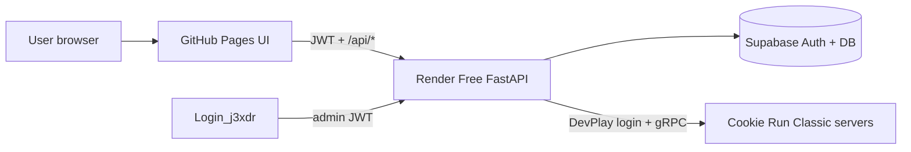

# 01 — Project overview & map

## Workspace layout

```
CookieRun_Classic API/
├── CKR WWDC/                 ← PRODUCTION web+API (git repo j3xdr/CKR-WWDC)
├── exe_รอทำ/                 ← WIP / local tooling (ไม่ใช่ Pages deploy)
│   └── PartyRun/
│       ├── partyrun_single_file.py   ← สคริปต์ฟาร์มต้นฉบับ single-file
│       ├── core/partyrun_core.py     ← core สำหรับ desktop shell
│       ├── app/                      ← desktop UI (WIP)
│       └── worker/                   ← Cloudflare Worker blob (WIP)
├── Login_j3xdr/              ← Admin UI (เติมโทเค็น / สร้าง user) — แยกจาก public farm
├── com.devsisters.crg/       ← APK / reverse artifacts
├── crg_ida/                  ← IDA work
├── MD/                       ← เอกสาร handoff ชุดนี้
└── opencode.json
```

## What is production vs WIP

| Area | Role | Deployed? |
|------|------|-----------|
| `CKR WWDC/` | Public farm website + FastAPI backend | **Yes** — Pages + Render |
| `CKR WWDC/server/farm/partyrun_core.py` | Farm engine ที่ API เรียกจริง | บน Render |
| `exe_รอทำ/PartyRun/partyrun_single_file.py` | สคริปต์อ้างอิง / ทดสอบ local / desktop WIP | **No** (local) |
| `Login_j3xdr/` | Admin console | Pages แยก |
| `static/` ใน CKR WWDC | สำเนา UI เก่าตอน Render เคยเสิร์ฟ HTML | **ไม่ใช่** source ของ Pages |

## CKR WWDC internal map

```
CKR WWDC/
├── index.html          ← GitHub Pages serves THIS (root)
├── css/styles.css
├── js/
│   ├── config.js       ← SUPABASE_URL, ANON_KEY, API_BASE (public)
│   ├── app.js          ← farm UI logic
│   └── level_xp.js     ← generated XP table
├── assets/             ← images used by Pages
├── assets_web/         ← untracked dump (ไม่จำเป็นต่อ production)
├── static/             ← stale mirror — อย่าแก้แทน root
├── server/
│   ├── main.py         ← FastAPI app
│   ├── farm_queue.py   ← FIFO queue + farm_lock helpers
│   └── farm/
│       └── partyrun_core.py
├── supabase/schema.sql
├── tools/
│   ├── build_level_xp.py
│   └── gen_assets.py
├── cookierun_level_table.md
├── render.yaml
├── Procfile
├── requirements.txt
└── .env / .env.example
```

## Live URLs

| Service | URL |
|---------|-----|
| UI | https://j3xdr.github.io/CKR-WWDC/ |
| API | https://ckr-wwdc.onrender.com |
| Health JSON | `GET /api/health` |
| Admin | https://j3xdr.github.io/Login_j3xdr/ |
| Repo | https://github.com/j3xdr/CKR-WWDC |

## Architecture (high level)



- **Pages** = static HTML/JS/CSS only (CORS allowlist includes `https://j3xdr.github.io`)
- **Render Free** = 1 instance, cold start, **ไม่รองรับฟาร์มพร้อมกันหลาย job**
- **Supabase** = Auth (username→synthetic email), `profiles.token_balance`, queue/lock tables, ledgers

## Product model (สั้นๆ)

- ผู้ใช้ล็อกอินเว็บด้วย **username + password** (ไม่โชว์ email)
- 1 **โทเค็นเว็บ** = 1 ครั้งฟาร์ม Party Run
- ฟอร์มรับ **DevPlay email/password ของเกม** แยกจากบัญชีเว็บ
- ผู้ใช้ใส่ score / coin / XP ที่ต้องการให้เกมเครดิตในรอบนั้น
- มีคิว FIFO + เทิร์น 2 นาที เพราะ Render Free รันทีละงาน

## Related but out of scope for farm UI

งาน reverse/guest reroll/DevPlay auth experiments อยู่ใน transcript/โฟลเดอร์อื่น (`_capture` อาจไม่มีแล้ว) — **ไม่ใช่** next task ของ WWDC peek
